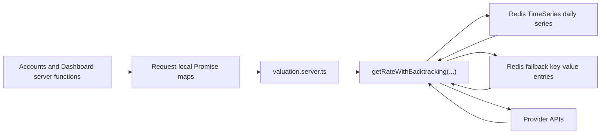
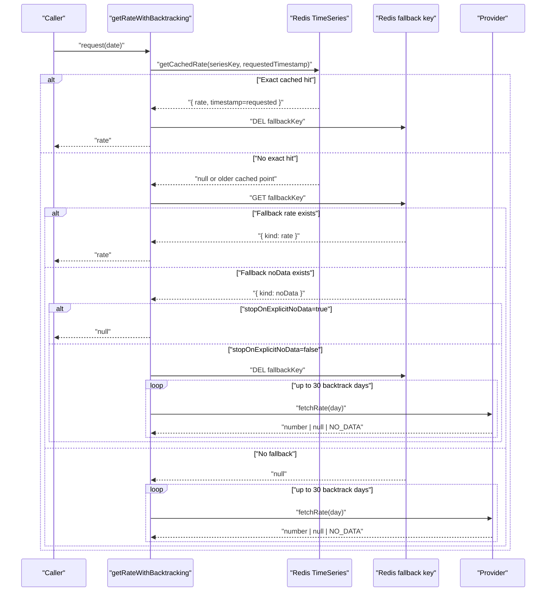
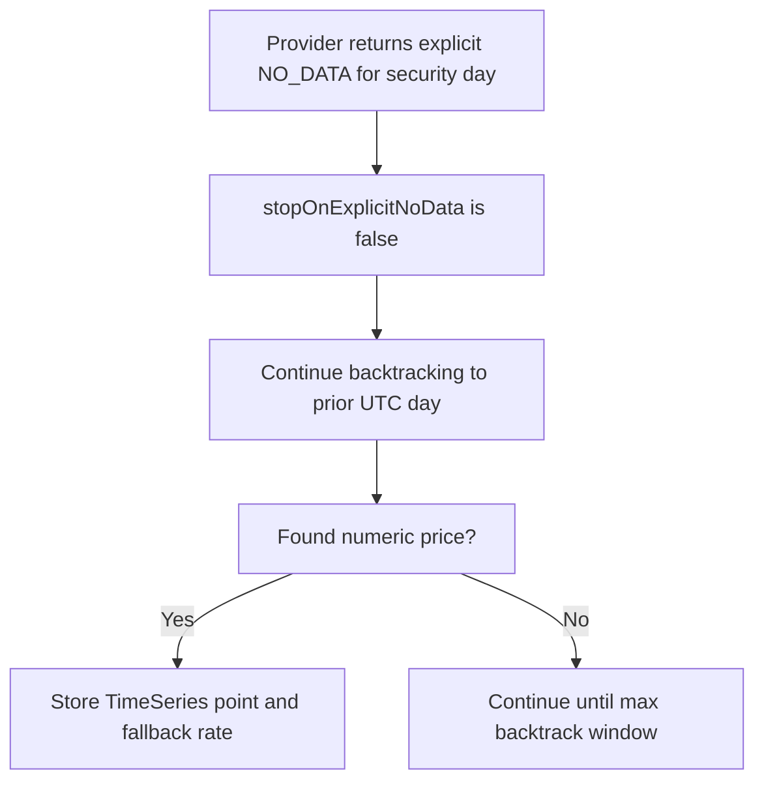

# Valuation Caching

Scope: This document describes the current valuation caching mechanism in
`apps/cashfolio-app2`. Unless noted otherwise, paths are relative to that app
directory.

## Why This Exists

Valuation lookups are needed to convert:

- currency balances
- cryptocurrency balances
- security quantities

into an account book's reference currency. External providers can be slow,
rate-limited, or missing data for specific dates. The caching design optimizes
for:

- low repeated provider calls
- deterministic daily (UTC) pricing lookup
- graceful behavior when Redis or providers are unavailable

## Where Valuation Is Used

Primary consumers:

- `src/server/accounts-queries.ts`
  - account tree reference balances
  - `getAccountReferenceBalances` lazy hydration endpoint
- `src/server/dashboard.ts`
  - historical booking conversion for income/expense charts

Exchange-rate entry points:

- `src/server/valuation.server.ts`
  - `getCurrencyExchangeRate`
  - `getCryptocurrencyToCurrencyExchangeRate`
  - `getSecurityToCurrencyExchangeRate`

## Caching Layers

There are three effective layers:

1. Request-local Promise memoization
2. Redis TimeSeries daily rates
3. Redis fallback string cache for backtracked results and explicit no-data

## Request-Local Memoization

This deduplicates identical lookups during a single server-function execution.

- `src/server/dashboard.ts`
  - Uses `exchangeRateByKey: Map<string, Promise<number | null>>`
  - Keys include source, target, and booking date (`YYYY-MM-DD`) so repeated
    bookings on the same date reuse one in-flight lookup.
- `src/server/accounts-queries.ts`
  - Uses per-request maps for currencies, cryptocurrencies, and securities.
  - For account reference balances, all lookups use `today`, so memoization keys
    do not need an explicit date.

This layer is in-memory only and is cleared after each request.

## Redis TimeSeries Cache (Primary Historical Cache)

Implementation: `src/server/valuation/cache.ts` (`getCachedRate`,
`storeCachedRate`)

- Daily bucket timestamp: `Date.UTC(year, month, day)` from
  `toSeriesTimestamp(...)`.
- Reads:
  - First tries exact day hit via `TS.RANGE key timestamp timestamp`.
  - If not found, reads newest prior point via `TS.REVRANGE key - timestamp`.
- Writes:
  - `TS.ADD` with `ON_DUPLICATE LAST`
  - retention: `VALUATION_SERIES_RETENTION_MS = 10 years`

### Series Key Formats

- Currency (USD base to target):
  - `valuation:currencylayer:USD:<TARGET_CURRENCY>`
- Cryptocurrency (USD per crypto):
  - `valuation:coinlayer:USD:<CRYPTO_SYMBOL>`
- Security close price in trade currency:
  - `valuation:marketstack:<SYMBOL>:<TRADE_CURRENCY>`

Defined in `src/server/valuation/keys.ts`.

## Redis Fallback Cache (Backtracking Shortcut)

Implementation: `src/server/valuation/cache.ts`
(`getBacktrackedFallbackFromCache`, `storeBacktrackedFallbackInCache`,
`clearBacktrackedFallbackFromCache`)

When a request needed backtracking to find a usable older value, the result is
stored under a fallback key scoped to the exact requested timestamp. This avoids
repeating API backtracking for near-term repeated requests.

### Fallback Key Formats

- Currency:
  - `valuation:currencylayer:fallback:USD:<TARGET_CURRENCY>:<REQUESTED_TIMESTAMP>`
- Cryptocurrency:
  - `valuation:coinlayer:fallback:USD:<CRYPTO_SYMBOL>:<REQUESTED_TIMESTAMP>`
- Security:
  - `valuation:marketstack:fallback:<SYMBOL>:<TRADE_CURRENCY>:<REQUESTED_TIMESTAMP>`

### Fallback Payload Types

- `{ kind: "rate", rate, sourceTimestamp }`
  - TTL: `BACKTRACKED_FALLBACK_TTL_SECONDS = 3600` (1 hour)
- `{ kind: "noData" }`
  - TTL: `BACKTRACKED_NO_DATA_FALLBACK_TTL_SECONDS = 300` (5 minutes)

Backward compatibility is preserved for older entries missing `kind` (treated as
`rate` entries when `rate` and `sourceTimestamp` are present).

## Core Lookup Algorithm

Implementation: `src/server/valuation/backtracking.ts`
(`getRateWithBacktracking`)

Behavior for a request date:

1. Normalize to UTC day timestamp.
2. Try TimeSeries cache.
3. If exact-day hit:
   - clear stale fallback key
   - return rate
4. If fallback key exists:
   - `kind: "rate"`: return cached fallback rate
   - `kind: "noData"`:
     - return `null` when `stopOnExplicitNoData = true`
     - otherwise clear fallback and continue
5. Backtrack day-by-day up to `MAX_BACKTRACK_DAYS` (30):
   - if an older cached TimeSeries point is now in range, reuse and store
     fallback `kind: "rate"`
   - otherwise call provider `fetchRate(date)`
   - on numeric rate:
     - store in TimeSeries
     - if backtracked day is older than requested day, store fallback
     - if exact day, clear fallback
     - return rate
   - on explicit no-data sentinel:
     - usually store fallback `kind: "noData"` and return `null`
     - for securities only (`stopOnExplicitNoData = false`), keep backtracking
   - on `null`, keep backtracking
6. If loop ends and an older cached TimeSeries point exists, store fallback and
   return it.
7. Otherwise return `null`.

## Provider Semantics and Cache Impact

Implementation: `src/server/valuation/providers.ts`

- Currencylayer (`fetchUsdToCurrencyRateFromCurrencyLayer`)
  - returns USD->target currency rate
  - explicit no-data is mapped to `NO_DATA_FETCH_RESULT`
- Coinlayer (`fetchUsdPerCryptocurrencyRateFromCoinLayer`)
  - returns crypto->USD rate
  - explicit no-data is mapped to `NO_DATA_FETCH_RESULT`
- Marketstack (`fetchSecurityPriceFromMarketstack`)
  - returns security close in account trade currency
  - retries `429` up to 3 times with 1-second delay
  - explicit no-data is mapped to `NO_DATA_FETCH_RESULT`
  - quote-currency mismatch is treated as unusable (`null`, not explicit no-data)

## Conversion Formulas (After Cached Lookup)

Implementation: `src/server/valuation.server.ts`

- Currency:
  - `source -> target = (USD->target) / (USD->source)`
- Cryptocurrency:
  - `crypto -> target = (crypto->USD) * (USD->target)`
- Security:
  - `security -> target = (securityPrice in tradeCurrency) * (tradeCurrency->target)`

All symbols/currencies are normalized to uppercase before key creation and
lookup.

## Security-Specific Behavior

`getSecurityPrice(...)` calls `getRateWithBacktracking` with
`stopOnExplicitNoData: false`.

This means security valuations continue searching older days even when the
provider says the requested day has explicit no data, which is common around
non-trading days.

## Constants That Control Behavior

Defined in `src/server/valuation/constants.ts`:

- `BASE_CURRENCY = "USD"`
- `MAX_BACKTRACK_DAYS = 30`
- `VALUATION_SERIES_RETENTION_MS = 10 years`
- `BACKTRACKED_FALLBACK_TTL_SECONDS = 3600`
- `BACKTRACKED_NO_DATA_FALLBACK_TTL_SECONDS = 300`
- Request timeouts (ms):
  - `CURRENCYLAYER_TIMEOUT_MS = 10000`
  - `COINLAYER_TIMEOUT_MS = 10000`
  - `MARKETSTACK_TIMEOUT_MS = 10000`

## Failure and Degradation Model

### Redis disabled or unavailable

Implementation: `src/redis.server.ts`

- Missing `REDIS_URL` logs one warning and returns `null` client.
- Redis connection failures log one warning and return `null` client.
- Valuation still works by calling providers directly; only cache benefits are
  lost.

### Cache read/write failures

Implementation: `src/server/valuation/cache.ts`

- Cache read failures degrade to provider lookups.
- Fallback cache write/delete failures are logged and ignored.
- Warnings are throttled with in-process boolean guards to avoid log spam.

### Provider/API failures

- Unexpected provider errors are thrown from provider helpers.
- Top-level valuation functions catch and log these errors, then return `null`
  so callers can continue rendering without crashing.

## Environment Requirements

Required for full valuation behavior:

- `CURRENCYLAYER_API_KEY`
- `COINLAYER_API_KEY`
- `MARKETSTACK_API_KEY`
- `REDIS_URL` (Redis with TimeSeries support)

Without provider keys, related conversions return `null` and log a one-time
warning.

## Practical Notes for Contributors

- Do not edit key formats casually. Existing cache history and fallback keys
  depend on stable naming in `src/server/valuation/keys.ts`.
- Keep date handling on UTC day boundaries (`toSeriesTimestamp`, `toUtcDay`).
- If tuning backtrack or TTL constants, update:
  - `src/server/valuation/constants.ts`
  - this document
  - tests in `src/server/valuation/backtracking.test.ts` as needed
